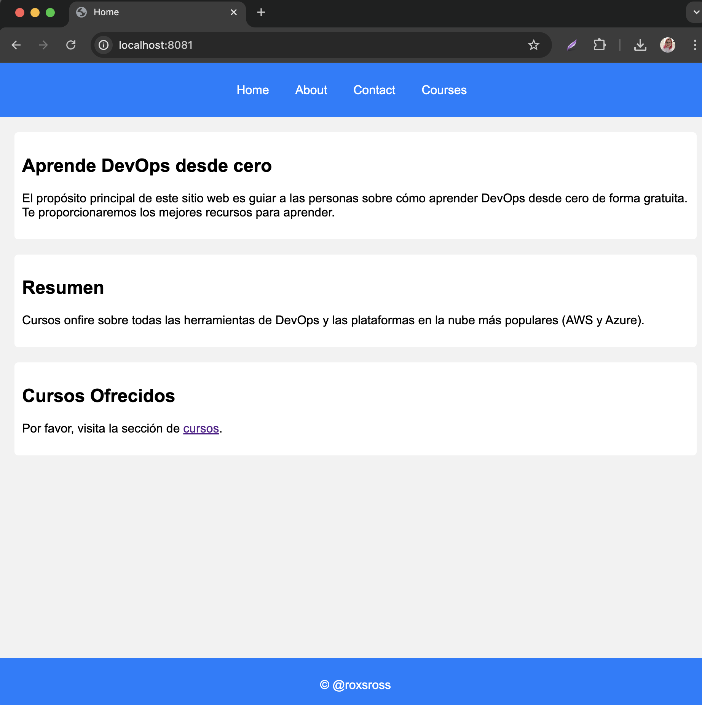

# Bootcamp DevOps by RoxsRoss


---


🔥🔥🔥🔥

---

# Aplicación Web en Go

Este es un sitio web simple escrito en Golang. Utiliza el paquete `net/http` para servir solicitudes HTTP.

## Ejecutar el servidor

Para ejecutar el servidor, ejecuta el siguiente comando:

```bash
go run main.go
```

El servidor comenzará en el puerto 8080. Puedes acceder a él navegando a `http://localhost:8080/courses` en tu navegador web.

## Se ve así



# ¡Dale una Estrella! ⭐

***Si estás planeando usar este repositorio para aprender, por favor dale una estrella. ¡Gracias!***


> Recuerda documentar los pasos y decisiones tomadas durante la configuraciónde este proyecto ¡Buena suerte!